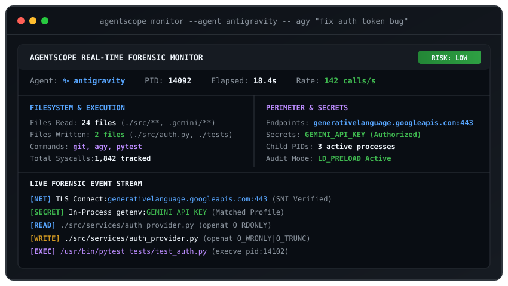
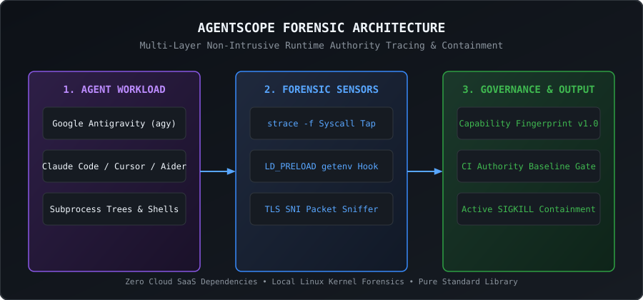

# agentscope

[](https://github.com/diluteoxygen/agentscope/actions)
[](https://github.com/diluteoxygen/agentscope/releases)
[](LICENSE)

**Local capability fingerprinting, real-time forensic monitoring, and runtime containment for AI coding agents.**

agentscope traces what an AI coding agent touches during a run (files read and written, commands executed, outbound network destinations, and in-process environment variables). It generates deterministic JSON capability fingerprints, visual diff reports, and lets you enforce authority bounds in CI or terminate rogue processes in real time.

---

<p align="center">
  
</p>

---

## Supported Agent Environments

AgentScope provides pre-configured authority profiles, secret detection rules, and network whitelists for:
- 🚀 **Google Antigravity (`agy`) / Antigravity IDE / Python SDK** (`--agent antigravity`)
- 🤖 **Anthropic Claude Code CLI** (`--agent claude`)
- ⚡ **Cursor IDE Background Agent** (`--agent cursor`)
- 💻 **Aider AI Pair Programmer** (`--agent aider`)
- 🌐 **Generic Autonomous Agents / Shell Workloads** (`--agent agent`)

---

## Architecture & How It Works

AgentScope requires **zero cloud SaaS services** and runs entirely locally on Linux using non-intrusive kernel observability:

<p align="center">
  
</p>

1. **Process & Syscall Tap**: Uses recursive multi-process `strace -f` and `/proc` to intercept all `open`, `execve`, and socket `connect` calls.
2. **In-Process Secret Auditor**: Thread-safe `LD_PRELOAD` C shim (`libagentscope_audit.so`) hooks libc `getenv()` to detect secret lookups made inside the interpreter.
3. **TLS SNI Packet Sniffer**: Binary TLS Client Hello parser extracts outbound domain names (`generativelanguage.googleapis.com:443`, `api.anthropic.com:443`) directly from network buffers.
4. **Deterministic Normalization**: Strips system library noise and generates sorted, canonical capability schemas.

---

## Installation

Requirements: Linux with Python 3.10+, `strace`, and `gcc`.

```bash
pip install agentscope-forensics
```

For local development:

```bash
git clone https://github.com/diluteoxygen/agentscope.git
cd agentscope
pip install -e .[dev]
```

---

## Quickstart & Key Commands

For detailed walkthroughs and usage examples, see **[How to Run & Test AgentScope](docs/RUNNING.md)**.

### 1. Trace an agent run

```bash
# Trace Google Antigravity
agentscope run --agent antigravity --summary -- agy "fix the auth token bug"

# Trace Claude Code with interactive HTML report export
agentscope run --agent claude --html report.html -- claude code
```

### 2. Live multi-pane terminal TUI monitor

Watch child processes, syscall rates, and live activity streams in real time:

```bash
agentscope monitor --agent antigravity -- agy "refactor tests"
```

### 3. Active runtime containment & enforcement

Block unauthorized secret access or rogue binary execution with immediate process termination (`SIGKILL`):

```bash
agentscope enforce --baseline .agent/authority-baseline.json -- agy "run database migration"
```

### 4. Diff capability changes between runs

```bash
# Terminal diff
agentscope diff run-183.json run-184.json

# Standalone interactive HTML diff dashboard
agentscope diff run-183.json run-184.json --html diff.html
```

### 5. Establish baseline & verify in CI

```bash
# Commit baseline
agentscope baseline --input agentscope.json --output .agent/authority-baseline.json

# Verify in CI
agentscope verify --baseline .agent/authority-baseline.json --candidate agentscope.json
```

### 6. Install Git safety hooks

```bash
# Automatically verify authority before commits & pushes
agentscope hook install
```

### 7. Export hardened sandbox policies

```bash
# Generate Docker / Seccomp / Bubblewrap confinement rules
agentscope export-policy --format docker
agentscope export-policy --format seccomp --output seccomp.json
agentscope export-policy --format bwrap
```

---

## GitHub Action

Add automatic agent authority gating to `.github/workflows/ci.yml`:

```yaml
name: Verify agent authority
on: [pull_request, workflow_dispatch]

jobs:
  verify:
    runs-on: ubuntu-latest
    steps:
      - uses: actions/checkout@v4
      - uses: diluteoxygen/agentscope@main
        with:
          baseline: '.agent/authority-baseline.json'
          candidate: 'agentscope.json'
          fail-on-escalation: 'true'
```

---

## Fingerprint Schema (v1.0)

Fingerprints are emitted as deterministic, sorted canonical JSON:

```json
{
  "schema_version": "1.0",
  "metadata": {
    "agent": "antigravity",
    "command": ["agy", "fix auth token bug"],
    "timestamp": "2026-08-21T12:00:00Z",
    "duration_ms": 18400,
    "exit_code": 0,
    "cwd": "/workspace/payment-service"
  },
  "capabilities": {
    "filesystem": {
      "read": [
        "./src/**",
        "~/.gemini/antigravity-cli/**"
      ],
      "write": [
        "./src/services/auth_provider.py",
        "./tests/test_auth.py"
      ]
    },
    "commands": [
      "agy",
      "git",
      "pytest"
    ],
    "network": [
      "generativelanguage.googleapis.com:443"
    ],
    "secrets": [
      "env:GEMINI_API_KEY"
    ]
  }
}
```

---

## Architecture & Design Records

- [How to Run & Verify AgentScope](docs/RUNNING.md)
- [Domain context and ubiquitous language](CONTEXT.md)
- [Agent standards](AGENTS.md)
- [ADR 0001: Linux syscall instrumentation model](docs/adr/0001-linux-syscall-instrumentation-model.md)
- [ADR 0002: Capability fingerprint schema](docs/adr/0002-capability-fingerprint-schema.md)
- [ADR 0003: CLI and CI baseline engine](docs/adr/0003-cli-and-ci-baseline-engine.md)
- [Empirical Agent Authority Comparison](docs/benchmarks/agent-authority-comparison.md)

---

## License

MIT
